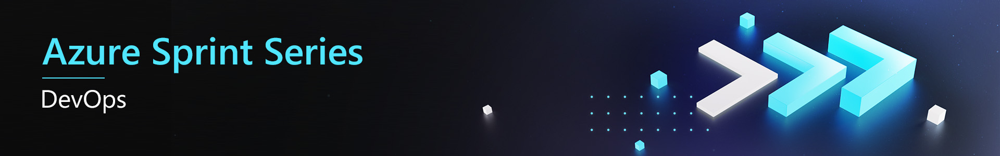

# Challenge 5: Building and shipping Containers
There are many different ways of deploying code, TAA have requested an investigation to see if containers can make their solution more portable and easier to manage.
- Releasing
- Deploying
- Monitoring

This challenge introduces containers - which enable easily reproducible environments, perfect for deploying microservices. Azure DevOps has extensive support for building and releasing containers.

# Exercise 1
The first step in containerising your application is to build your code into a deployable image that is then used to instantiate a container. Build each of the services into a Docker image then run each service within a container on your development machine.

## Hints
- Refer to the helpful resources for example Dockerfiles
- Pass settings using environment variables

## Helpful resources
* [Dockerfile reference](https://docs.docker.com/engine/reference/builder/)
* [Introduction to .NET and Docker](https://docs.microsoft.com/en-us/dotnet/core/docker/introduction)
* [Dockerize an ASP.NET Core Application](https://docs.docker.com/engine/examples/dotnetcore/)

# Exercise 2
Now that the containers are running successfully locally, update the Azure DevOps Build Pipeline to build the source code into containers and push to an Azure Container Registry (ACR).

## Hints
- Create a single Azure Container Registry resource, this can make it easier to ensure the image is the same across environments
- Ensure you tag your containers when you release them to ACR. 

## Helpful resources
* [Azure Container Registry Documentation](https://docs.microsoft.com/en-us/azure/container-registry/)
* [Build and Push to Azure Container Registry](https://docs.microsoft.com/en-us/azure/devops/pipelines/ecosystems/containers/acr-template?view=azure-devops&tabs=dotnet-core)
* [Azure Container Registry](https://docs.microsoft.com/en-us/azure/container-registry/)

# Exercise 3
Now the containers are ready to be deployed, update the Release Pipelines to deploy the Containers into multiple Azure Web App for Containers services in your test and production environments.

## Hints
* You can manually deploy the Web App for Containers resources manually and use Azure DevOps to push the containers. Bonus points if you update your ARM template first.

## Helpful resources
* [Deploy to Azure using Docker](https://docs.microsoft.com/en-us/azure/app-service/containers/quickstart-docker)

# Exercise 4
Setting up an entire environment can be challenging. Docker Compose enables developers to design multi-container applications easily while ensuring that the application can be tested easily.

Make a Docker Compose file that starts all the services and runs them locally. 

## Hints
- Pass settings using environment variables from the host to reduce the amount of container changes.
- You may need to trust new self-signed SSL certificates or pass them through from the host.

## Helpful resources
- [Docker Compose](https://docs.docker.com/compose/)
- [HTTPS Development of Local Containers](https://github.com/dotnet/dotnet-docker/blob/master/samples/aspnetapp/aspnetcore-docker-https-development.md)

# Exercise 5
There is another benefit in defining how containers work together using an orchestrator such as Docker Compose. Some containers are built only to support the primary application and make sense to be treated as a single unit within the same lifecycle. These containers commonly proxy traffic, log requests or provide authentication to a specific service. It is possible to expose only the services you need to the public and manage the lifecycle of those containers together while still keeping your microservices decoupled and isolated from each other.

Bundle the frontend web app and all backend services into one Docker Compose file and release it to a multi-container Web App using Azure DevOps. Only expose the frontend website to public internet traffic.

## Hints
- Pass settings using environment variables from the host to reduce the amount of container changes.
- Deploy the Identity Service separately.

## Helpful resources
* [CI/CD for Containers Architecture](https://azure.microsoft.com/en-us/solutions/architecture/cicd-for-containers/) 
* [Create a multi-container app](https://docs.microsoft.com/en-us/azure/app-service/containers/quickstart-multi-container)
* [Docker Compose](https://docs.docker.com/compose/)
* [The Sidecar Pattern](https://docs.microsoft.com/en-us/azure/architecture/patterns/sidecar)
